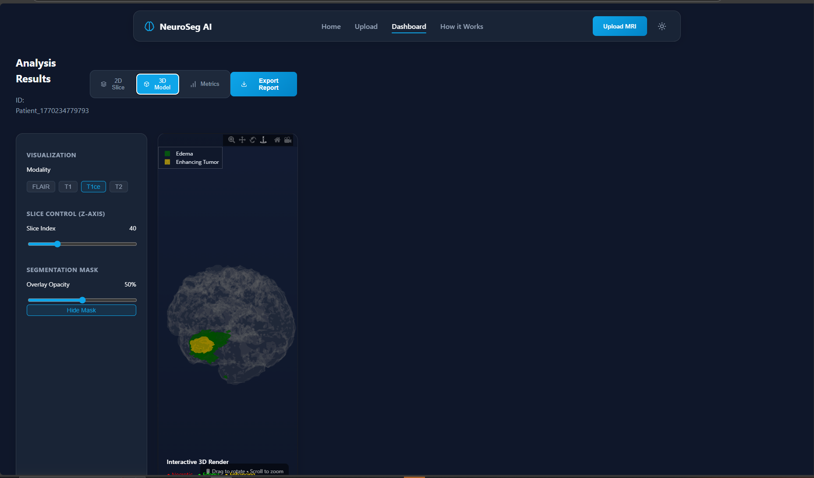

<div align="center">

# 🧠 NeuroSeg AI - Brain Tumor Segmentation

[](https://python.org)
[](https://pytorch.org)
[](LICENSE)
[](https://neuroseg_ai.datacraft.in.net/)

**AI-Powered Brain Tumor Segmentation using Deep Learning**

*Automatic segmentation of glioma sub-regions from 3D MRI scans*

[🌐 Live Demo](https://neuroseg_ai.datacraft.in.net/) • [🤗 Hugging Face](https://huggingface.co/spaces/manarsaber11/BrainTumor) • [📊 Competition](https://www.kaggle.com/competitions/instant-odc-ai-hackathon/)

</div>

---

## 📋 Overview

This repository contains our solution for the **Brain Tumor Segmentation Challenge**, where we developed deep learning models to automatically segment glioma sub-regions from multi-parametric MRI (mpMRI) scans. Our solution achieved **89% validation accuracy** and **76% on the competition leaderboard** using the Mean Dice Coefficient metric.

### 🎯 Challenge Description

Gliomas are the most common primary brain malignancies with different degrees of aggressiveness and heterogeneous histological sub-regions. This project tackles the instance segmentation task of outlining exact tumor boundaries in 3D space.

**Tumor Classes:**
| Label | Class | Description |
|-------|-------|-------------|
| 1 | Necrotic Tumor Core (NCR) | Dead tissue inside the tumor |
| 2 | Peritumoral Edema (ED) | Swelling surrounding the tumor |
| 4 | GD-enhancing Tumor (ET) | Active, growing part of the tumor |

---

## 🏆 Results

<div align="center">

| Model | Architecture | Validation Accuracy | Leaderboard Score |
|-------|-------------|---------------------|-------------------|
| Pipeline 1 | ResNet34-UNet | **89%** | **76%** |
| Pipeline 2 | Residual U-Net 2D | **86%** | **76%** |

</div>

### 📸 Model Predictions

<div align="center">

#### Ground Truth vs AI Prediction
<table>
<tr>
<td align="center"><b>Ground Truth</b></td>
<td align="center"><b>AI Prediction</b></td>
</tr>
<tr>
<td></td>
<td></td>
</tr>
</table>

#### Web Application Interface


</div>

---

## 🏗️ Architecture

### Pipeline 1: ResNet34-UNet (Pre_Trained)

A custom U-Net architecture with a pretrained ResNet34 encoder for robust feature extraction.

**Key Features:**
- 🔹 **Encoder**: Pretrained ResNet34 backbone (ImageNet weights)
- 🔹 **Input**: 4-channel MRI (FLAIR, T1, T1ce, T2) - modified first conv layer
- 🔹 **Decoder**: Custom ConvBlocks with skip connections
- 🔹 **Output**: 4-class segmentation map (128×128)

```
📁 Pipeline 1/
├── config.py      # Hyperparameters & settings
├── dataset.py     # BraTS2D dataset loader
├── model.py       # ResNet34-UNet architecture
├── losses.py      # Dice + CrossEntropy combined loss
└── train.py       # Training loop
```

**Configuration:**
```python
IMG_SIZE: 128
BATCH_SIZE: 64
LEARNING_RATE: 1e-4
EPOCHS: 20
SLICES_PER_PATIENT: 70
TARGET_PATIENTS: 544
```

### Pipeline 2: Residual U-Net 2D (Manual Architecture)

A lightweight custom residual U-Net built from scratch with skip connections and data augmentation.

**Key Features:**
- 🔹 **Architecture**: Custom ResidualBlocks with shortcut connections
- 🔹 **Channels**: 32 → 64 → 128 → 256 (Encoder) → Decoder
- 🔹 **Data Augmentation**: Rotation, flip, brightness, elastic transform
- 🔹 **Mixed Precision**: FP16 training with GradScaler
- 🔹 **Loss Function**: Weighted CrossEntropy + Dice Loss (class imbalance handling)

```
📁 Pipeline 2/
├── config2.py     # Hyperparameters & settings
├── dataset.py     # Dataset with augmentations
├── model2.py      # Residual U-Net architecture
├── loses.py       # Combined loss with class weights
├── metric.py      # Dice score metric
├── train2.py      # Training with mixed precision
├── inference.py   # 3D volume inference
└── brats_unet2d_final (15).pth  # Trained model weights
```

**Configuration:**
```python
IMG_SIZE: 128
BATCH_SIZE: 64
LEARNING_RATE: 3e-4
EPOCHS: 20
SLICES_PER_PATIENT: 75
TARGET_PATIENTS: 344
```

---

## 📊 Dataset

The data is derived from the **BraTS (Brain Tumor Segmentation) Challenge**, consisting of multi-parametric MRI scans.

**MRI Modalities:**
| Modality | Description |
|----------|-------------|
| **T1** (Native) | Useful for structural analysis |
| **T1ce** (Post-contrast) | Highlights enhancing tumor (active cells) |
| **T2** (T2-weighted) | Shows brain outline and fluids |
| **FLAIR** | Critical for detecting edema (swelling) |

All files are in NIfTI (`.nii.gz`) format.

---

## 🚀 Getting Started

### Prerequisites

```bash
pip install torch torchvision nibabel opencv-python numpy albumentations tqdm
```

### Training

**Pipeline 1:**
```bash
cd "Pipeline 1"
python train.py
```

**Pipeline 2:**
```bash
cd "Pipeline 2"
python train2.py
```

### Inference

```python
from Pipeline2.model2 import ResUNet2D

model = ResUNet2D(n_classes=4)
model.load_state_dict(torch.load("Pipeline 2/brats_unet2d_final (15).pth"))
model.eval()
```

---

## 🌐 Deployment

### Web Application
Our model is deployed as an interactive web application:

🔗 **Live Demo**: [https://neuroseg_ai.datacraft.in.net/](https://neuroseg_ai.datacraft.in.net/)

📂 **Web Application Source Code**: [https://github.com/MostafaAyman3/Revesion/](https://github.com/MostafaAyman3/Revesion/)

**Features:**
- 📤 Upload MRI scans in NIfTI format
- 🖼️ 2D slice visualization with modality selection
- 🧊 Interactive 3D brain tumor rendering
- 📊 Segmentation metrics display
- 📥 Export analysis reports

### Hugging Face Spaces
Also available on Hugging Face for easy access and experimentation.

---

## 📈 Evaluation Metric

Submissions are evaluated using the **Mean Dice Coefficient**:

$$\text{Dice} = \frac{2|P \cap G|}{|P| + |G|}$$

Where:
- **P** = Predicted set of pixels
- **G** = Ground truth
- Score of **1.0** = Perfect match
- Score of **0.0** = No overlap

---

## 📁 Project Structure

```
5M-s-Brain-Tumor-Segmentation-Hackathon/
├── README.md
├── EDA for Brain Tumor.ipynb    # Exploratory Data Analysis
├── deployment video.mp4          # Deployment video
├── Pipeline 1/                   # ResNet34-UNet
│   ├── config.py
│   ├── dataset.py
│   ├── model.py
│   ├── losses.py
│   └── train.py
├── Pipeline 2/                   # Residual U-Net 2D
│   ├── config2.py
│   ├── dataset.py
│   ├── model2.py
│   ├── loses.py
│   ├── metric.py
│   ├── train2.py
│   ├── inference.py
│   └── brats_unet2d_final (15).pth
└── assets/
    ├── 3d_visualization.png
    ├── model_prediction.jpeg
    └── neuroseg_webapp.jpeg
```

---

## 🙏 Acknowledgements

- **BraTS Challenge** - Data provided by the RSNA-ASNR-MICCAI BraTS Challenge
- **Kaggle** - Platform hosting the competition
- Contributing institutions and organizers for making this dataset available

---

## 👥 Team 5M

Built with ❤️ for the Brain Tumor Segmentation Challenge

---

<div align="center">

**⭐ Star this repository if you found it helpful!**

</div>
